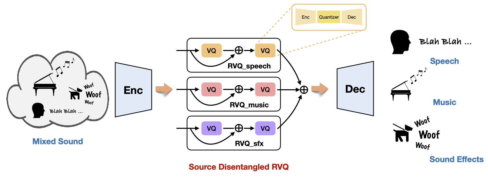

# SD-Codec

**Learning Source Disentanglement in Neural Audio Codec**

[Xiaoyu Bie](https://xiaoyubie1994.github.io/), [Xubo Liu](https://liuxubo717.github.io/), [Gaël Richard](https://www.telecom-paris.fr/gael-richard?l=en)

**[[arXiv](https://arxiv.org/abs/2409.11228)]**, **[[Project](https://xiaoyubie1994.github.io/sdcodec/)]**

<p align="center">  </p>

## Enviroment Setup
All our models are trained on 8 A-100 80G GPUs

```
conda env create -f environment.yml
conda activate gen_audio
```

The code was tested on Python 3.11.7 and PyTorch 2.1.2

## Dataset Preparation

We use the following dataset:
- [Divide and Remaster (DnR)](https://zenodo.org/records/6949108)
- [DNS-Challenge 5](https://github.com/microsoft/DNS-Challenge)
- [MTG-Jamendo](https://mtg.github.io/mtg-jamendo-dataset/)
- [MUSAN](https://www.openslr.org/17/)
- [WHAM!](http://wham.whisper.ai/)

```bash
mkdir manifest

# DnR
pyhthon prepare/mani_dnr.py --data-dir PARH_TO_DnR

# DNS Challenge 5
pyhthon prepare/mani_dns_clean.py --data-dir PARH_TO_DNS_CLEAN # or by partition
pyhthon prepare/mani_dns_noise.py --data-dir PARH_TO_DNS_NOISE

# Jamedo
pyhthon prepare/mani_jamendo.py --data-dir PARH_TO_JAMENDO # or by partition

# MUSAN
pyhthon prepare/mani_musan.py --data-dir PARH_TO_MUSAN

# WHAM
pyhthon prepare/mani_wham.py --data-dir PARH_TO_WHAM
```

## Training
```
# debug on single GPU
accelerate launch --config_file config/acc/fp16_gpus1.yaml main.py --config-name debug +run_config=slurm_debug

# training on 8 GPUs
accelerate launch --config_file config/acc/fp16_gpus8.yaml main.py --config-name default +run_config=slurm_1
```

## Evaluation
By default, we use the last checkpoint for the evaluation
```
model_dir=PATH_TO_MODEL
nohup python eval_dnr.py --ret-dir ${model_dir} --csv-path ./manifest/val.csv --length 5 > ${model_dir}/val.log  2>&1 &
nohup python eval_dnr.py --ret-dir ${model_dir} --csv-path ./manifest/test.csv --length 10 > ${model_dir}/test.log  2>&1 &
```


## Citation
If you find this project usefule in your resarch, please consider cite:
```BibTeX
@article{bie2024sdcodec,
  author={Bie, Xiaoyu and Liu, Xubo and Richard, Ga{\"e}l},
  title={Learning Source Disentanglement in Neural Audio Codec},
  journal={arXiv preprint arXiv:2409.11228},
  year={2024},
}
```


## Acknowledgments
Some of the code in this project is inspired or modifed from the following projects:
- [AudioCraft](https://github.com/facebookresearch/audiocraft)
- [DAC](https://github.com/descriptinc/descript-audio-codec)